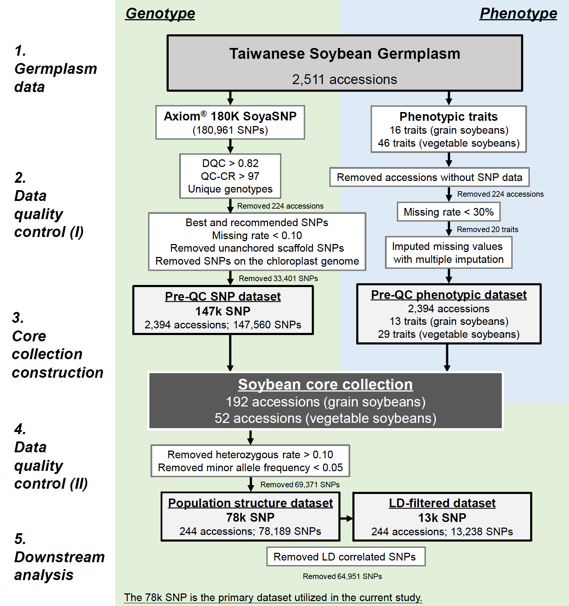

# **Materials and methods** {#sec-materials-and-methods}

```{=html}
<!-- Google tag (gtag.js) -->
<script async src="https://www.googletagmanager.com/gtag/js?id=G-LKV6J2QECN"></script>
<script>
  window.dataLayer = window.dataLayer || [];
  function gtag(){dataLayer.push(arguments);}
  gtag('js', new Date());

  gtag('config', 'G-LKV6J2QECN');
</script>
```
## **Germplasm resources and phenotypic data collection** {.unnumbered}

A total of 2,618 Taiwanese soybean accessions from the NPGRC at the
Taiwan Agricultural Research Institute were classified into 2,511 grain
soybeans and 107 vegetable soybeans. Phenotypic evaluations followed
strict protocols at the Kaohsiung District Agricultural Research and
Extension Station over four consecutive autumn cropping seasons from
1995 to 1998, as detailed in Kao et al. (2021). Initial datasets
comprised 16 grain soybean traits and 47 vegetable soybean traits,
subsequently reduced to 13 and 29 traits, respectively, after applying a
\<30% missing data threshold. The incorporation of diverse phenotypic
traits spanning various aspects of soybean morphology, phenology,
growth, and production (refer to ~~Supplementary Table 1-2~~) enhances
phenotype variation and core collection representativeness. Overall
missing rates were 7.5% and 10.8% for grain and vegetable soybeans,
categorized as missing completely at random or missing at random. Prior
studies have shown that missing phenotypes can influence genetic
distance calculations, potentially affecting core collection
representativeness (Huang et al. 2022; Penone et al. 2014). Utilizing
multiple imputation methods to address missing data mitigates this
issue, ensuring that the derived core collection accurately reflects the
phenotypic diversity of Taiwanese soybean germplasm. This enhances the
reliability and utility of the core collection for downstream analyses
and breeding applications. We employed the R program v.4.3.1 (R Core
Team 2023) with package *mice* (Van Buuren and Groothuis-Oudshoorn 2011)
for multiple imputation on the grain soybean and vegetable soybean
phenotypic data.

## **Genotyping and quality control protocol** {.unnumbered}

DNA extraction and purification from 2,618 soybean accessions utilized
the DNeasy 96 Plant Kit (QIAGEN) system, ensuring an A~260~/A~280~ ratio
of 1.8-2.0 and concentration ≥ 60 ng/μl. Genotyping employed the
Axiom^®^ SoyaSNP180K (180,961) chip array (Lee et al. 2015). The
criteria, including a batch’s quality (Dish quality control \> 0.82) and
sample call rate (\> 97%), led to the exclusion of 33 redundant and 191
poor-quality samples. Filtering retained single nucleotide polymorphisms
(SNPs) with missing rate \< 0.10, excluding 366 unanchored scaffold SNPs
and chloroplast genome SNPs (refer to **Supplementary Fig. 1**). The
quality-filtered SNP dataset comprised 147,560 SNPs, with a call rate of
99.78%. Further refinement using the command --maf 0.05 --hardy on PLINK
v.1.9 (Chang et al. 2015) filtered out SNPs with rare variants (i.e.,
minor allele frequency (MAF) \< 0.05) and heterozygous rate \< 0.10,
resulting in a final dataset of 78,189 SNPs. Additionally, applying
linkage disequilibrium (LD) pruning (r^2^ \> 0.5), we identified sets of
SNPs that are not in strong LD (r^2^ \< 0.5) with each other within the
window size (50 SNPs) and step size (5 SNPs) by the command
--indep-pairwise 50 5 0.5, yielded 13,238 SNPs. Rigorous quality control
criteria and refinement steps aim to exclude erroneous or low-quality
SNPs, ensuring robust downstream analyses and accurate interpretation of
population structure.

{width="650"}

> **Supplementary Fig. 1** Flowchart illustrating the quality control
> process for soybean genotypic and phenotypic data, leading to the
> construction of core collection and subsequent downstream analysis in
> the present study

## **Core collections construction and assessment** {.unnumbered}

To establish a representative and manageable subset of accessions that
capture most of the genetic diversity for optimal utilization of
germplasm resources in breeding programs and genetic studies, the core
collection of Taiwanese vegetable and grain soybeans was constructed to
minimize redundancy within germplasm pools. Principal coordinate
analysis was executed on the quality-filtered 147k SNP dataset using
Tassel v.5.0 software (Bradbury et al. 2007), enabling the
identification of principal components (PCs) capturing 80% of the total
genetic variation. Subsequently, the PowerCore program v.1.0 (Kim et al.
2007) systematically facilitated the selection of core accessions based
on phenotypic traits and the PCs derived from genotypic data, resulting
in a core collection comprising 192 accessions for grain soybeans and 52
accessions for vegetable soybeans. Combining advanced analytic
techniques such as PCoA and PowerCore ensures efficient resource
allocation, thereby enhancing the reliability and robustness of core
collection construction. Detailed information regarding soybean
accessions is provided in ~~Supplementary Table 3~~. Further analyses
were performed using the 147k SNP dataset to ensure the preservation of
genetic variation and data structure, including principal components
analysis (PCA) and assessment of diversity and statistical parameters.

Statistical parameters and allelic coverage were conducted for both
grain and vegetable soybean core collections, providing insights into
representativeness and effectiveness of core collections in capturing
genetic diversity. Statistical parameters [mean difference percentage
(MD%), variance difference percentage (VD%), coincidence rate (CR%),
variable rate (VR%), and allelic coverage percentage (Coverage%)] were
evaluated according to Huang et al. (2021). For detailed elucidation of
the concept and mathematical formulations pertinent to the methods
employed, please consult ~~Online Resource 1~~.

## **Phylogenetic and population structure analysis** {.unnumbered}

The population structure and genetic diversity of soybean accessions
were assessed using the 78k SNP dataset, filtered with MAF \< 0.05. An
unweighted pair group method with arithmetic mean (UPGMA) phylogenetic
tree was constructed utilizing the R packages *poppr* (Kamvar et al.
2014) and *ggtree* (Yu et al. 2017), with 1,000 bootstrap replicates, to
visualize genetic relatedness across soybean accessions. Discriminant
analysis of principal components (DAPC) analysis was conducted using the
R package *adegenet* (Jombart 2008) to identify genetic clusters and
discriminates among soybean accessions, preceded by data transformation
through PCA and discriminant analysis. The number of clusters was
determined via a *k*-means clustering algorithm based on the Bayesian
information criteria (BIC). Principal components selection for DAPC
followed Cattell’s rule as recommended by Thia (2023). To validate
population structure, DAPC was performed on datasets containing 78k SNPs
and compared with those obtained from the 147k and 13k SNP datasets to
enhance the robustness of the findings.

## **Genetic diversity and differentiation analysis** {.unnumbered}

A large-scale genome dataset comprising 78k SNPs was utilized to assess
genetic diversity within and among soybean types. Various indicators
including observed heterozygosity, fixed allele count, and genetic
diversity statistics such as Nei’s genetic diversity (Nei 1973),
polymorphic information content (PIC) (Botstein et al. 1980), nucleotide
diversity (π) (Korunes and Samuk 2021), and GC content, were evaluated
at each locus. These metrics offer insights into the genetic variation
and selection pressures among soybean accessions. Analyses were
performed using the R package *snpReady* (Granato et al. 2018) and
custom R scripts.

The LD decay rate was calculated separately for five groups and two
soybean types utilizing PLINK (Chang et al. 2015) with specific
parameters (--r2 --ld-window-r2 0 --ld-window 99999 --ld-window-kb
1000), considering all SNP pairs within a 1 Mb window size and with no
LD threshold. LD decay provides information on genetic recombination
dynamics and linkage intervals. Pairwise Nei’s genetic distances (Nei
1972) and *F*~ST~ (Wright 1949) between groups were computed using the R
package *hierfstat* (Goudet 2005) to uncover differentiation among
different groups of soybeans. The R package *poppr* (Kamvar et al. 2014)
was utilized to conduct analysis of molecular variance (AMOVA)
(Excoffier et al. 1992), allowing for the assessment of population
structure across hierarchical levels: among groups, among individuals
within groups, and within individuals. The significance of population
structure was tested using 999 random permutations for robust
statistical validation. For detailed elucidation of the concept and
mathematical formulations pertinent to the methods employed, please
consult ~~Online Resource 1~~.

## **Genome-wide scans for selection footprints** {.unnumbered}

To unveil loci potentially under artificial selection in vegetable
soybeans, we conducted genome-wide scans using quality-controlled 78k
SNP data. Our objective was to accurately pinpoint these regions, known
as selection footprints, and elucidate their role in enhancing vegetable
soybean traits. Employing the R package *pcadapt* (Luu et al. 2017),
recognized for its robustness in detecting signals of selection and
adaptation (Duforet-Frebourg et al. 2016), we configured specific
parameters. In our analysis, specific parameter (K = 1, only retain the
first PC) to discern genomic differences between vegetable soybeans and
grain soybeans. To rigorously control false positives, we applied the
Benjamini-Hochberg procedure (Benjamini and Hochberg 1995) with a false
discovery rate threshold of 0.5%, corresponding to a *p*-value \<
1.0×10^-5^. Selective regions linked to vegetable soybean improvement
were identified within 25 kb upstream or downstream of significant SNPs
(i.e., selection footprints), with intervals smaller than 20kb merged.
These identified selective regions served as targets for further
exploration of associated variants or genes underlying desirable traits.
Validation of selection footprints was conducted through phenotypic
trait analysis, particularly the 100-seed weight, establishing a
genotype-phenotype relationship and ensuring the reliability of our
findings. Detailed information on the methodological concept and
formulas can be found in ~~Online Resource 1~~.

## **Gene annotation and quantitative trait loci (QTLs) prediction** {.unnumbered}

To elucidated gene functions within selection regions and prioritize
candidate genes for functional validation, we obtained functional
annotation and ontology data of soybean genes from Phytozome
(<https://phytozome-next.jgi.doe.gov/info/Gmax_Wm82_a2_v1>) and SoyBase
(<http://www.soybase.org>) databases (Brown et al. 2021; Goodstein et
al. 2012). These databases were utilized to understand the functions and
pathways associated with the candidate genes.

Predicting QTLs associated with key traits is crucial for understanding
the genetic basis of desirable characteristics. To validate the
relevance of the selection regions to traits, we compared the functional
validation results with findings from genome-wide association studies
(GWAS) in SoyBase (<https://www.soybase.org/GWAS/list.php>). This GWAS
QTL list consisted of 3,133 QTLs distributed across 20 chromosomes,
significantly associated with specific traits (e.g., seed coat color,
seed weight, plant height, etc.), totaling more than 100 traits
identified in global GWAS researches. Furthermore, we integrated QTLs
from a GWAS concerning four pivotal traits of vegetable soybean
conducted by Li et al. (2019) into our investigation. This comparison
aimed to establish connections between selection regions and traits
observed in vegetable soybeans. The soybean reference genome version
Wm82.a2.v1 was consistently used throughout the study.
